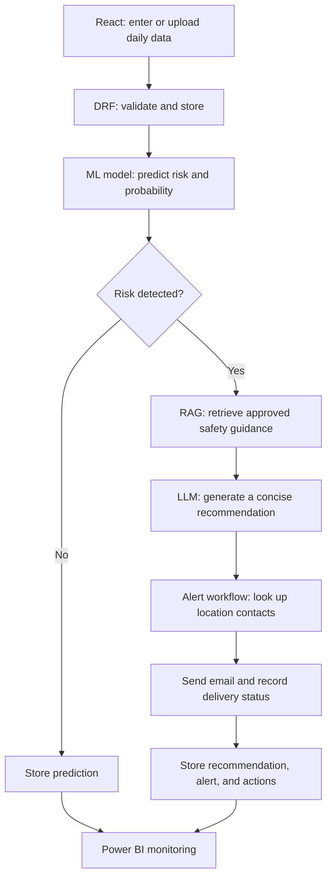

# Wayanad Landslide Early Warning & Response System

An end-to-end prototype for collecting daily landslide-monitoring data, estimating risk, sharing document-grounded safety guidance, and coordinating alerts to relevant contacts.

> **Project status:** This repository currently contains the Django project foundation and a React/Vite frontend scaffold. The prediction API, operational data models, ML/RAG/agent workflows, email delivery, and Power BI dashboards described below are implementation goals, not yet available features.

## Project objective

Build a system that receives landslide-related testing data, predicts risk with a machine-learning model, retrieves approved safety guidance when risk is detected, and coordinates notifications. The application is organized around a React frontend, Django REST Framework (DRF) backend, operational database, and Power BI reporting.

## End-to-end workflow

1. An operator enters or uploads daily testing data in the React frontend.
2. React submits the data to a DRF API.
3. DRF validates the request, stores the testing record, and passes the model features to the landslide model.
4. The model returns a prediction and probability/risk score.
5. For a no-risk result, the backend stores the prediction and finishes processing that record.
6. For a risk result, the backend retrieves relevant approved safety information and generates a concise recommendation.
7. The alert workflow identifies the affected location and retrieves its relevant emergency contacts.
8. The system sends the recommendation and risk details to those contacts by email and records the outcome.
9. Predictions, recommendations, alerts, and workflow actions are stored for monitoring and reporting.
10. Power BI reads the stored reporting data to show risk, location, trend, and alert activity.



## Architecture and responsibilities

| Component | Responsibility |
| --- | --- |
| React frontend | Enter/upload daily testing data and display predictions, risk, recommendations, and alert status. |
| Django REST Framework | Expose APIs, validate requests, coordinate prediction and response workflows, and persist results. |
| ML model | Predict landslide risk from the defined environmental/testing features. |
| RAG pipeline | Retrieve relevant passages from approved landslide safety and preparedness documents. |
| LLM | Turn retrieved context into a concise, understandable precaution or recommendation. |
| Alert agent/workflow | Look up relevant contacts, prepare and send alerts using approved tools, and record each action. |
| Database | Store locations, testing data, predictions, contacts, alerts, and workflow audit records. |
| Email service | Deliver notifications and return a delivery outcome for tracking. |
| Power BI | Present risk overview, location risk, historical trends, and alert monitoring. |

### Keep AI responsibilities distinct

- **ML** estimates landslide risk from input features.
- **RAG** retrieves information from trusted project documents.
- **LLM** generates natural-language recommendations grounded in retrieved information.
- **Agent/workflow** performs explicit actions such as contact lookup, alert preparation, email delivery, and logging.
- **DRF** validates and orchestrates the application workflow; it remains the authority for data handling and API behavior.
- **Power BI** analyzes operational data; it does not make predictions or trigger response actions.

### Jev and structured decision-making

Jev is described in this project plan as an AI model from TypeSafe AI intended primarily for structured decision-making rather than long-form text generation. If evaluated and adopted, it may support bounded structured decisions in the workflow. It does not replace the landslide prediction model, the retrieval pipeline, or the LLM's recommendation-generation role. Before integration, verify the model's current availability, capabilities, API, and suitability for the intended use; keep risk thresholds and safety-critical alert policy explicit and testable.

### Harness Engineering

Harness Engineering is the practice of building the environment around an AI agent so it can work reliably: tools, context, rules, tests, and feedback mechanisms. For this system, that means constraining agent tools to approved operations, grounding recommendations in approved sources, validating inputs and outputs, recording tool actions, testing failure paths, and requiring clear delivery status. The harness supports and limits agent behavior; it is not itself the ML model, RAG pipeline, or LLM.

## Proposed data model

| Entity | Main fields |
| --- | --- |
| `Location` | `id`, `name`, `district`, `latitude`, `longitude`, `risk_zone` |
| `TestingData` | `id`, `location_id`, `rainfall`, `soil_moisture`, `slope`, `temperature`, `timestamp` |
| `Prediction` | `id`, `testing_data_id`, `location_id`, `prediction`, `probability`, `risk_level`, `created_at` |
| `EmergencyContact` | `id`, `name`, `role`, `location_id`, `phone`, `email` |
| `Alert` | `id`, `prediction_id`, `location_id`, `message`, `sent_at`, `status` |
| `AgentExecution` | `id`, `alert_id`, `action`, `tool_used`, `status`, `executed_at` |

These are proposed entities, not a description of existing Django models. The implementation should define relationships, constraints, indexes, retention rules, and access controls as the schema is built.

## RAG and recommendation workflow

1. Collect approved landslide safety, evacuation, preparedness, and precaution documents.
2. Extract and split the documents into meaningful chunks.
3. Generate embeddings and store them with document/source metadata in a vector index.
4. For a risk prediction, build a retrieval query from the location, risk level, and relevant conditions.
5. Retrieve the most relevant chunks and pass them, with source information, to the LLM.
6. Generate a concise recommendation grounded in the retrieved context.
7. Store the recommendation and its source references with the prediction/alert record.

## Alert workflow

For a risk event, the backend should identify the affected location, retrieve its relevant contacts, and prepare an alert that includes the prediction, recommendation, and location. The email service should return a clear delivery status. Record recipients or recipient count as appropriate, tool/action details, timestamps, and failures. Avoid treating a prepared alert as a successfully delivered alert.

## Power BI dashboard plan

| Dashboard | Key information |
| --- | --- |
| Risk overview | Total predictions, high/medium/low risk counts, and today's alerts. |
| Location risk map | Locations with current risk levels and prediction values. |
| Historical trends | Daily, weekly, and monthly prediction and risk trends. |
| Alert monitoring | Alerts generated, delivery status, affected locations, and timestamps. |

Provide Power BI with a stable, appropriately permissioned reporting data source. Prefer read-only reporting access or curated views over direct access to application write operations.

## Implementation action plan

1. Finalize the landslide model, input features, prediction output, and risk-level thresholds.
2. Build the Django/DRF prediction API and define request/response validation.
3. Implement database models for locations, testing data, predictions, contacts, alerts, and agent executions.
4. Connect and test the trained ML model in the backend.
5. Build the React data-entry/upload and prediction-results experiences.
6. Collect, approve, and organize the knowledge documents.
7. Implement document extraction, chunking, embeddings, vector storage, and retrieval.
8. Integrate an LLM to generate source-grounded precaution recommendations.
9. Define bounded agent tools for contact lookup, alert preparation, email delivery, and audit logging.
10. Connect the alert workflow to risk predictions and implement delivery-status tracking.
11. Prepare the Power BI data source and dashboards.
12. Test normal-risk and landslide-risk scenarios, including failures and unavailable services.
13. Add validation, structured logging, error handling, and audit information.
14. Document the architecture, APIs, model, RAG pipeline, agent tools, database, and dashboards.

## Development setup

### Backend

From the repository root, create and activate a virtual environment, install the dependencies, apply migrations, and run Django:

```powershell
python -m venv .venv
.\.venv\Scripts\Activate.ps1
pip install -r requirements.txt
python app\manage.py migrate
python app\manage.py runserver
```

The backend project settings are in `app/config`. The API endpoints and application models still need to be implemented.

### Frontend

In a separate terminal:

```powershell
cd frontend
npm install
npm run dev
```

The frontend is a Vite/React scaffold. A production bundle can be checked with `npm run build`.

## Repository layout

```text
app/        Django project
data/       Project data (add approved datasets/documents here as appropriate)
frontend/   React and Vite application
models/     Machine-learning model assets/code
notebooks/  Exploratory and model-development notebooks
```

## Example scenario

An operator submits daily measurements for a Wayanad location. DRF validates and stores them, then calls the landslide model. If the model indicates high risk, the backend retrieves relevant approved safety guidance, generates a concise recommendation, looks up contacts for the affected location, and sends an email alert. The prediction, recommendation, alert delivery outcome, and workflow actions are saved and made available for Power BI reporting.
